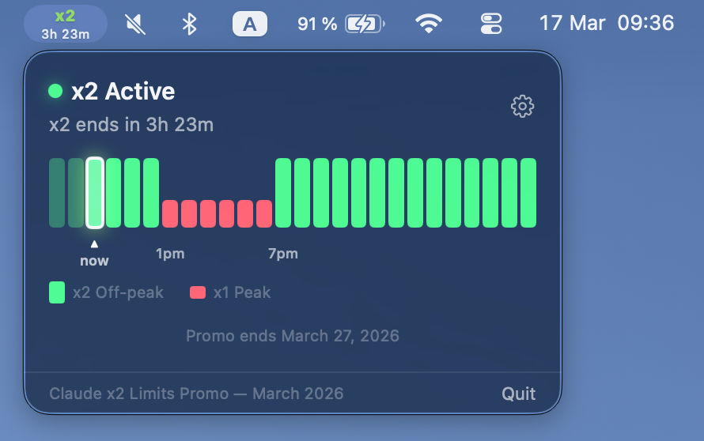

# ClaudePromo

A lightweight macOS menu bar app that tracks Anthropic's **Claude March 2026 x2 usage limits promotion**, showing your current rate multiplier and a live countdown to the next transition.

> **Official announcement:** [Claude March 2026 Usage Promotion](https://support.claude.com/en/articles/14063676-claude-march-2026-usage-promotion)

## Promotion Schedule

**Dates:** March 13 – 27, 2026

During the promotion, usage limits are **doubled** outside of peak hours:

| When | Multiplier |
|------|-----------|
| Weekdays 8:00 AM – 2:00 PM ET | **x1** — normal limits |
| Weekdays 2:00 PM – 8:00 AM ET (next day) | **x2** — doubled limits |
| Weekends (Sat & Sun, all day) | **x2** — doubled limits |

In short: if it's a weekday morning or early afternoon, you're in peak hours (x1). All other times — evenings, nights, and full weekends — you get doubled limits (x2).



## Features

- **Live menu bar badge** — shows `x2` (green) or `x1` (red) with a countdown to the next transition
- **26-hour timeline** — segmented bar visualizing past, current, and upcoming x2/x1 blocks
- **Animated "now" indicator** — highlights the current hour with a glow effect
- **Notifications** — optional alerts 30 and 10 minutes before each x2 start or end
- **Auto-open on launch** — popover appears automatically at startup
- **Promo end screen** — graceful state after March 27

## Requirements

- macOS 14 Sonoma or later
- Xcode 15+

## Installation

Clone the repository and build with Xcode:

```bash
git clone https://github.com/vanab/ClaudeMarchPromo.git
cd ClaudeMarchPromo
open ClaudePromo.xcodeproj
```

Select the `ClaudePromo` scheme and press **⌘R** to run.

## Project Structure

```
ClaudePromo/
├── ClaudePromoApp.swift           # App entry point, menu bar icon rendering
├── Models/
│   └── PromoSchedule.swift        # Schedule logic, status & transition calculations
├── Views/
│   ├── PopoverContentView.swift   # Main popover UI
│   ├── PromoTimelineView.swift    # 26-hour segmented timeline
│   └── SettingsView.swift         # Notification preferences
└── Services/
    └── NotificationManager.swift  # Local notification scheduling
```

## License

MIT
